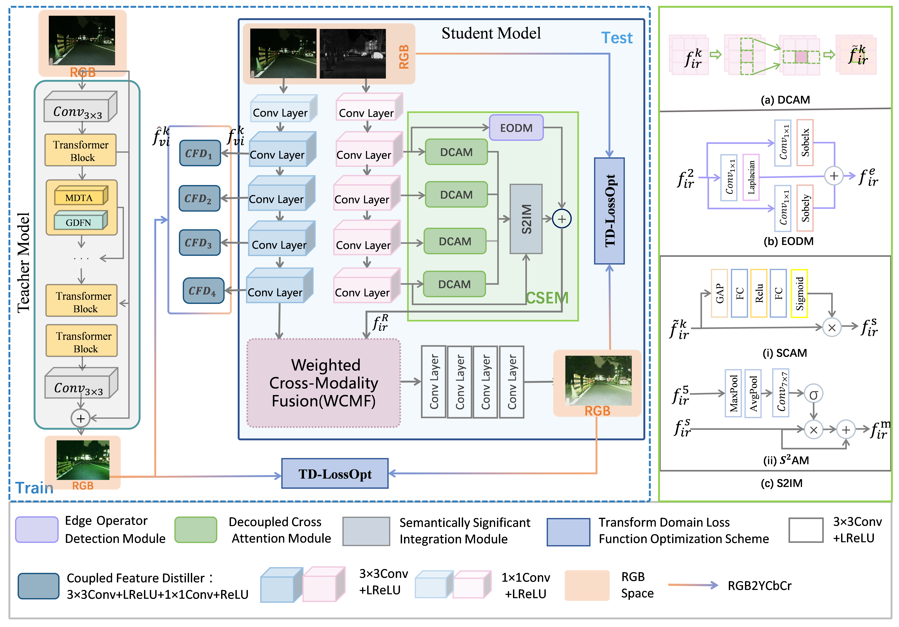

# UIKDF
This is official Pytorch implementation of "A Unified Framework: Knowledge Distillation Based Scene Enhancement and Color Preservation for Infrared and low-light Image Fusion".  

# Framework
The overall framework of the proposed KDFuse.

# To Train
1.  Place the paired datasets in the folder `'./datasets/train/'.`
2. run `train_S.py`

# To Test
1. Download the checkpoint from [fusion_model](https://pan.baidu.com/s/1DRooKrL3vhS2qiJMa_Pjmw?pwd=es67) and put it into `'./pretrained/'`.
2. Place the paired test images in the folder `'./datasets/test/'`.
3. The result data_root are put in `'./test_results/'`.
   

Then run `testS.py`.